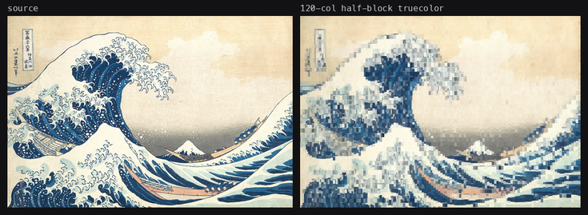
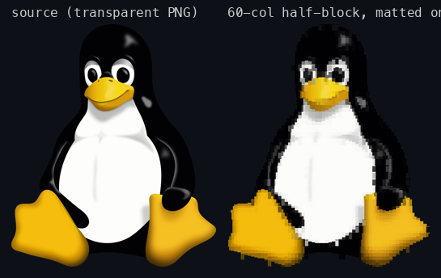

# image-to-ansi

A [Claude Code](https://claude.com/claude-code) skill: give it an image, get back
a terminal-renderable string — ANSI half-block art, colour ASCII, or plain
monochrome ASCII — sized and formatted for wherever it's actually going to be
displayed. CLI splash screens, TUI banners, README art, `neofetch`-style logos,
login screens.

## Why

Anyone can `chafa image.png`. What actually takes work is everything around
that: terminal art is a fixed grid of character cells, so it doesn't reflow —
handling that width problem, picking the right symbol set and colour depth for
where the art lands, getting transparent PNGs right (blend with the theme, or
matte onto a background — that's a decision, not a default), and shipping a
clean, verified deliverable that's actually safe to `cat`.

## What it looks like

**Photographic fidelity** — half-block symbols, 24-bit truecolor, 120 columns:



**A CLI startup banner** — transparent PNG matted onto the terminal's own dark
theme instead of showing a hard-edged box, half-block, 60 columns:



**Monochrome ASCII**, for README code blocks (colour gets stripped by GitHub,
so this mode inks the subject in plain characters instead):

```text
        :=+*+**+=+=:                       :=++++=-:
     -*%*::.===*=+**%*=-               :=*#*+-==-:==##=
   =%#. .**=-.    .:::.                .----:..:-=++ .=%=
 .#@=  *#:              ..           .             :#= .@#.
 #@+  *#            -*%%#****=.  .+##*#%#=.          #- -@#
-@%- .#           -#*-.      -#+==-=..  .=#+         :* .#@:
+@@: :*         :#*.           *@@+@%:.    -#-       .* .#@=
=@@= :#       .*#:    .:-:::-+*+@@%##*=: .  .**.     =+ :%@-
.@%+  +#-   :+*:.-*#%%@%#+#@@@#####=%@@#+@@#= :*+. .=*: -%@.
 +@#.  .**%+-.:*@@@@@%-#.:@@%%%*#@%*#* +@+@@@%: .-#+=  .*@=
  +@*-    .  -@@@@@@%*%@%@%%%%+@%+@@@-+%%+@@@@@:     .:*@=
   :#@#--.  -@@@@@@@@@#@@*--  *@@%@@@*-  =%@@@@%. :=*#@*:
     :+#@%*:@@@@@@@@@##@@@##++%%@@@@@@%-=+@@@@@@%-=#*=.
         ..#@@@@@@@@#:@@@@@@@@@%@@@@@@@@+*-+%@@@@@=
          .%@@@@@@@++#%@@@@@@@@@#**#%@@@@+.  :-+###=
         .%@@@@@#=+%@@%@@@@@@@@:=#@@#**%@@#===.
        =#@*=-:   #@@@@@@@#@@@@-#*:=+@@##@@@@@+
       .:..       *@@@@@@%%@#@%@@@%@%*@@@@@@@%:
                  .#@@@@@@@@@**@@@@@@@@@@@#+:
                   -*@@@@@@@@@+#@@@@@@@@@%@%+
                     -+@@@@@@@@#+*####**+===:
                      #@@@@@@@@@@@%#%%@@@@@.
                       .:*@@@@@@@@#*++====-
                         -%+*@@@@@%*#%=
                         --  -@@@@@@%@@.
                              =#@@%*-=:
                                %:
```

## Install

```
claude plugin marketplace add evan-mcgeek/skills
claude plugin install image-to-ansi@evan-mcgeek-skills
```

Restart Claude Code. The skill activates automatically — no need to invoke it
by name. Ask for any of these and it'll trigger:

- *"make my logo show up when my CLI starts"*
- *"convert this photo to ansi art as close to the original as possible"*
- *"turn this into ascii art I can paste in my README"*
- *"how do I show an image in a resizable ratatui/textual/ink panel"*

## What's inside

- **`SKILL.md`** — the workflow: pick chafa or the bundled fallback, choose
  symbol set and colour depth for the target, handle the width-doesn't-reflow
  problem (a size ladder, or re-render at display time), decide transparency
  (blend vs. matte — and produce both when you can't know the target), verify
  the result is actually safe to `cat` (clean reset, no stray cursor codes).
- **`scripts/img2ansi.py`** — dependency-light fallback renderer (decodes via
  Pillow, ImageMagick, or macOS `sips`; needs neither Pillow nor chafa
  installed to degrade gracefully). Half-block or ASCII, any colour depth,
  auto-detected ink direction for ASCII mode.
- **`scripts/ansi2png.py`** — rasterises a rendered `.ansi` file back to a PNG,
  so you (or the person you're handing it to) can see the result without a
  truecolor terminal. Understands chafa's full block-element/eighths glyph set
  and reverse-video compression.
- **`references/packaging.md`** — templates for shipping the result: a raw
  file, a self-rendering shell script, a language string literal (Python /
  Go / Rust / JS / C), or wiring into a TUI framework's live render loop.

## License

MIT
